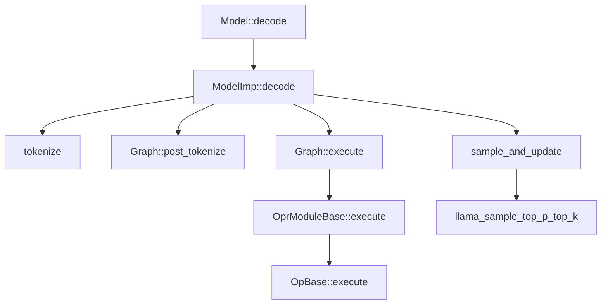
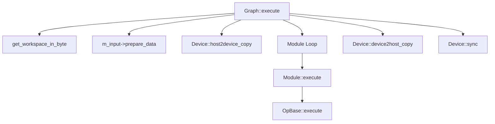

# InferLLM `src` 目录总览

## 目录鸟瞰
- `src/core`：推理主干，涵盖 `Model/ModelImp`、`Graph`、算子模块、Tensor/KV 缓存、设备与线程池。
- `src/graph`：面向不同模型族（LLaMA、Baichuan、ChatGLM/2/3）的 `Graph` 派生类，负责解析权重文件、拼装模块、特殊 token 处理。
- `src/kern`：算子后端抽象与实现。`kernel.h` 统一入口，子目录包含 naive、平台优化（x86/ARM/RVV）以及 GPU CUDA 实现，并提供 int4/int8 量化块定义。
- `src/file.cpp` / `src/file.h`：轻量文件读取层，支持 `mmap` 加速大模型权重加载。
- `src/utils.cpp` / `src/utils.h`：词表与采样工具、轻量定时器、格式化与断言宏，供 `ModelImp` 及算子复用。

## 核心执行层（`src/core`）
### 核心职责
- `src/core/graph.cpp`：管理 token 执行流程。`Graph::execute` 会按批次设置输入、复用工作区缓冲区并同步设备输出，再把 logits 返回给上层。
- `src/core/model_imp.cpp`：负责把配置、词表和计算图串起来，并驱动 prefill / decode，使推理流程贯通。
- `src/core/op.h`：`OprModuleBase` 定义模块化包装，把多个算子串成一段子图，统一推断输出形状与临时内存需求。

```cpp
// src/core/graph.cpp:166
void Graph::execute(
        std::vector<int32_t> in_token, std::vector<float>& logist,
        uint32_t nr_past, bool prefill) {
    if (m_input->dims() == 0 || !same_input_shape(in_token)) {
        m_input->set_shape({in_token.size()}, DType::Int32);
        size_t len = get_workspace_in_byte();
        if (m_workspace->ptr() == nullptr) {
            auto data = m_device->allocate(len);
            m_workspace->set_memory(data, len);
        } else if (m_workspace->ptr() && len > m_workspace->length()) {
            m_device->free_device(m_workspace->ptr());
            auto data = m_device->allocate(len);
            m_workspace->set_memory(data, len);
        }
    }
    ...
    m_device->sync();
    m_output->recall_data();
}
```

### 设备与并发层
- `src/core/device.h` / `src/core/device.cpp`：抽象统一/分离内存模型并暴露 `Kernel` 句柄。`CPUDevice` 维护按大小分类的内存池；`GPUDevice` 封装 CUDA 资源并提供异步拷贝接口。
- `src/core/thread_pool.cpp`：实现 CPU 内核使用的线程池，可按需激活/休眠，避免空转。

```cpp
// src/core/device.cpp:34
void* CPUDevice::allocate(size_t len) {
    auto it = m_free_memory.lower_bound(len);
    void* ptr = nullptr;
    if (it != m_free_memory.end() && it->second.size() > 0) {
        ptr = it->second.back();
        it->second.pop_back();
        if (it->second.size() < 1) {
            m_free_memory.erase(it);
        }
    } else {
        ptr = aligned_alloc(len);
        m_alloc_memory[ptr] = len;
    }
    return ptr;
}
```

### Tensor 与 KV 缓存
- `src/core/tensor.h` / `src/core/tensor.cpp`：`Tensor` 记录形状、步长、dtype 与所有者引用计数，按需 mmap 或分配显存/主内存，权重在加载时可以根据算子需求做预处理（例如 int4 重排）。
- `src/core/kvstorage.h` / `src/core/kvstotage.cpp`：`KvStorage` 继承 `Tensor` 用于注意力缓存，追踪当前写入位置，不够时自动扩容并保持连续的 key/value 区间。

```cpp
// src/core/kvstotage.cpp:53
TensorState KvStorage::prepare_data_with_length(uint32_t len) {
    Tensor::prepare_data();
    if (m_store_id + len >= m_curr_id) {
        auto shape = this->shape();
        shape[0] = m_curr_id + KvStorageConfig::KV_STEP;
        size_t old_len = length_in_byte();
        void* old_ptr = ptr();
        set_shape(shape, dtype());
        size_t len = length_in_byte();
        auto data = device()->aligned_alloc(len);
        device()->device2device_copy(data, old_ptr, old_len);
        device()->aligned_free(old_ptr);
        set_shared_memory(data, len);
        m_curr_id += KvStorageConfig::KV_STEP;
    }
    ...
    return TensorState::Own;
}
```

### 计算图模块
- 注意力模块（`graph.h` 中模板定义，`op.cpp` 中实现）组合 QKV matmul、RoPE、KV 缓存更新与输出投影，派生类覆盖 LLaMA、GLM 及 GLM2 多 Query 版本。
- 前馈模块（`LlamaFFNModule`、`GlmFFNModule`、`Glm2FFNModule`）还原各模型的激活链路（SiLU gating、GELU、双激活）并封装成算子序列。
- `HeadModule` 在 prefill 阶段跳过最终 logits，只在生成阶段执行 layer norm + 最后一 token 的 matmul。
- `Graph::collect_weights` 与 `Graph::get_weight_alias` 汇总模块权重并重写层号别名，保证加载阶段能对齐转换后的权重命名。

### 基础算子
- `OpBase` 统一 `pre_execute` / `execute` / `end_execute` 生命周期，并管理输入输出的引用计数。派生算子直接调用后端 `Kernel`。
- `MatMul` / `MatMulLast` 支持 float/int8/int4 权重，可对 int4 权重执行 `MatmulInt4WeightReorder` 打包以匹配优化核。
- 注意力算子负责生成 QKV，申请临时空间（保存 Q、K、V 以及 qk 中间结果），应用 RoPE、softmax，并与 KV 缓存矩阵相乘生成输出。
- 其他算子（`LayerNorm`、`Embedding`、`Elemwise`、`SpliteHalfActiveMul`、`SoftMax`、`DiagMask`）是对特定 kernel 的轻量封装。

```cpp
// src/core/op.cpp:243
std::vector<size_t> MatMul::preprocess_weight(Tensor* tensor, void* src, void* dst) {
    INFER_ASSERT(tensor->dtype() == DType::Int4, "only support optimized int4 kernel");
    auto weight_shape = tensor->shape();
    size_t M = weight_shape[0];
    size_t N = weight_shape[1];
    auto kernel = get_kernel();
    kernel->operator()<KernelID::MatmulInt4WeightReorder>(M, N, dst, src, PACK_SIZE);
    size_t block_m = M / PACK_SIZE;
    m_weight_packed = true;
    return {block_m, N * PACK_SIZE};
}
```

### 推理流程粘合层
- `Model` 对外暴露 `load`、`init`、`prefill`、`decode`、`decode_iter` 等接口，本身只是 `ModelImp` 的薄封装。
- `ModelImp` 选择设备后初始化 `Graph`，并维护运行态：上下文长度、KV 缓存重置、抽样队列与计时统计。
- `ModelImp::tokenize` 通过动态规划最大化子串得分，按需插入 BOS；`decode_summary` 汇总延迟与吞吐指标。

## 调用关系图





## 模型专用计算图（`src/graph`）
- `graph_imp.cpp` 在 `ModelImp::init` 阶段根据模型名分发到对应 `Graph` 派生类，确保后续构图/加载逻辑与权重格式匹配。

```cpp
// src/graph/graph_imp.cpp:4
std::shared_ptr<Graph> Graph::make_graph(
        UserConfig model_config, Device* device, const std::string& name) {
    if (name == "llama") {
        return std::make_shared<GgmlLlamaGraph>(model_config, device, name);
    } else if (name == "chatglm") {
        return std::make_shared<ChatGLMGraph>(model_config, device, name);
    }
    ...
}
```

- `chatGLM*.h/.cpp`、`ggml_llama.*`、`llama_like.*`：覆盖 `set_weights_alias`、`construct_llm`、`load_param`、`post_tokenize`，填充对应模型的模块序列和 tokenizer 特性（如 ChatGLM 的 gmask、BOS/CLS 处理）。
- 模型 Graph 依赖 `core/kvstorage.h` 来贯通 KV 缓存，并在 `construct_llm` 中把注意力、FFN、Head 模块按层注册进 `Graph::m_oprs`，最终由 `Graph::execute` 驱动。

## 算子后端（`src/kern`）
- `kernel.h` 暴露统一的 `Kernel` 入口，内部根据 `KernelType` 选择 CPU naive、平台优化或 GPU CUDA 实现，并复用 `ThreadPool` 以并行执行 `KernelID` 对应的任务。
- `kernel_define.h` 声明所有 `KernelID`、`KernelType`、`KernelOptMethod` 以及量化块结构（`BlockQ40`、`BlockQ80` 等），供算子和权重预处理共享。
- `kern/naive`：功能正确的参考实现（`naive.cpp` / `naive.h`），通常在调试或无 SIMD 支持的平台上 fallback。
- `kern/optimized/{x86,arm,rvv}`：针对不同 ISA 的 SIMD/矩阵乘加优化版本，并提供 `optimized.h` 统一导出入口。
- `kern/gpu`：封装 CUDA/cuBLAS kernel（`kernel_gpu.cu` / `kernel_gpu.h`），`GPUDevice` 会把句柄塞给 `Kernel` 以调用。

```cpp
// src/kern/kernel.h:24
template <KernelID Id, typename... Args>
void Kernel::operator()(Args... args) {
    if (m_kernel_type == KernelType::GPU) {
        gpu::Comp<Id, Args...>::exec(std::forward<Args>(args)..., m_handle);
    } else {
        TaskSet task_set =
                opt::Comp<Id, Args...>::get_all_task(std::forward<Args>(args)...);
        for (auto& task : task_set) {
            m_thread_pool->add_task(task.first, task.second);
        }
    }
}
```

## 共享基础设施（`src/file.*` 与 `src/utils.*`）
- `InputFile` 封装随机访问与 `mmap`，加速大模型权重加载并保持接口简洁（`read_raw`、`read_data`、`read_u32`、`read_string` 等）。

```cpp
// src/file.cpp:8
InputFile::InputFile(const std::string& path, bool enable_mmap)
        : m_enable_mmap{enable_mmap} {
    m_file = fopen(path.c_str(), "rb");
    INFER_ASSERT(m_file, "Failed to open model file.");
    ...
    if (m_enable_mmap) {
        m_mmap_addr = mmap(NULL, m_size, PROT_READ, flags, m_fd, 0);
        INFER_ASSERT(m_mmap_addr != MAP_FAILED, "mmap failed.");
    }
}
```

- `utils.h`/`utils.cpp`：提供 `Vocab` 加载、`Timer`、`make_unique`、采样与日志宏。`ModelImp::decode` 流程依赖 `llama_sample_top_p_top_k` 进行温度/Top-K/Top-P 控制。

```cpp
// src/utils.cpp:14
Vocab::Id llama_sample_top_p_top_k(
        const Vocab& vocab, const float* logits, std::list<Vocab::Id>& last_n_tokens,
        double repeat_penalty, int top_k, double top_p, double temp, std::mt19937& rng) {
    ...
    std::discrete_distribution<> dist(probs.begin(), probs.end());
    int idx = dist(rng);
    return logits_id[idx].second;
}
```

- `utils.h` 末尾定义 `INFER_ASSERT`、`CUDA_CHECK` 等宏，贯穿 core/kern/graph，帮助统一错误处理与日志格式。
